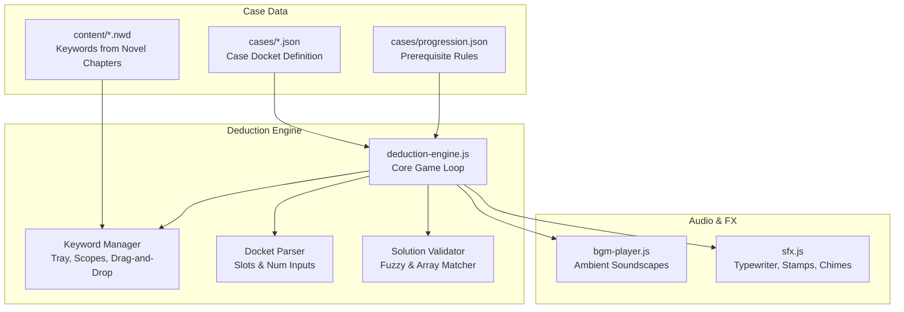

# Detective Game & Deduction Engine Guide

The **Deduction Engine** (`reader/game.html` and `reader/engine/deduction-engine.js`) is an interactive investigation game interface where players reconstruct timelines, analyze physical evidence, collect keywords from the novel, and solve MVD criminal dockets.

---

## 🏗️ Architecture & Component Flow



---

## 📜 Case File Structure (`reader/cases/*.json`)

A case is written in clean, human-readable JSON without manual HTML tags:

```json
{
  "meta": {
    "title": "CASE 1: MORNING ROUTINE",
    "caseNumber": "01",
    "classification": "TOP SECRET // MVD CLASSIFIED",
    "docketTitle": "📋 MVD FORM 0-A // MORNING COGNITIVE EVALUATION",
    "successMessage": "☭ DEDUCTION VERIFIED! Case 1 Confirmed.",
    "unlocks": {
      "chapter": "content/27601e10419ce.nwd",
      "title": "Chapter 1: The ROVD",
      "description": "Proceed to the Novel Reader to continue reading the story."
    }
  },
  "initialKeywords": [
    "North",
    "South",
    { "word": "fled", "category": "verb" },
    { "word": "sedan", "category": "noun" }
  ],
  "chapterScope": [
    "content/27601e10419ce.nwd"
  ],
  "scenes": [ ... ],
  "docket": "...",
  "solution": { ... }
}
```

---

## 🔍 In-Universe Declarative Evidence Artifacts

Writers can define realistic Soviet retro-futuristic evidence objects using clean JSON blocks:

### 1. Smart Device / GLONASS Phone
```json
{
  "type": "Smart Device",
  "title": "Phone",
  "phone": {
    "network": "☭ SOV-NET 5G // ROAMING",
    "battery": "88%",
    "time": "07:25",
    "date": "14th [April]",
    "nav": {
      "arrow": "↱",
      "subtitle": "GLONASS ACTIVE GUIDANCE (350m)",
      "instruction": "Turn right at next crossroad",
      "destination": "Destination: 1.6 km from [ROVD]"
    },
    "messages": [
      {
        "app": "MESSAGING APP",
        "time": "07:22",
        "sender": "Alex ([best friend])",
        "text": "Hey bro, wanna go out for a [drink] tonight?"
      }
    ]
  }
}
```

### 2. ID Badge / Pass Card
```json
{
  "type": "ID Card",
  "title": "Name plate",
  "badge": {
    "avatar": "👤",
    "dept": "FEBRAS PIRM Institute",
    "name": "[Luka] [Huo]",
    "role": "[Theoretical Physics] Department"
  }
}
```

### 3. Polyclinic Medical Prescription (Rx)
```json
{
  "type": "Prescription",
  "title": "Pill bottle",
  "rx": {
    "dispensary": "Polyclinic Dispensary #4",
    "status": "PARTIAL",
    "active": true,
    "drug": "Prescribed daily [medication] bottle.",
    "date": "21 [March]",
    "doctor": "polyclinic [doctors]"
  }
}
```

### 4. Audio Voicemail / Wiretap Tape
```json
{
  "type": "Audio Log",
  "title": "Voicemail recording",
  "audio": {
    "label": "⏺ COMM-REC // OUTGOING VOICEMAIL",
    "time": "00:32 / 00:45",
    "lines": [
      { "speaker": "Voicemail Greeting", "text": "This is Professor [Stanislav Krotov]...", "type": "system" },
      { "speaker": "Luka Huo", "text": "Professor, I need to call in sick today...", "type": "user" }
    ]
  }
}
```

---

## 🧩 Docket Slot Syntax & Validation

The case docket is written in markdown with interactive slot tags:

| Slot Syntax | Purpose | Behavior |
| :--- | :--- | :--- |
| `[slot:slot_id]` | Open Word Slot | Shows all collected keywords in an autocomplete dropdown. |
| `[slot:slot_id:category]` | Constrained Slot | Filters choices strictly to keywords tagged with `category` (e.g. `[slot:suspect:name]`). |
| `[num:slot_id:len:hint]` | Numeric Slot | Renders a fixed-length numeric input (e.g. `[num:year:4:YYYY]`, `[num:hour:2:HH]`). |

### Solution Verification
Solutions support exact string matches or arrays of acceptable alternatives:
```json
"solution": {
  "time_hour": "07",
  "time_min": "25",
  "suspect_name": "Luka",
  "country": ["USSR", "Russia SFSR", "Soviet Union"]
}
```

---

## 🔒 Universal Progression & Locks (`progression.json`)

The progression engine coordinates unlocks bidirectionally between the novel reader and the investigation game:

```json
{
  "version": "2.0",
  "rules": [
    {
      "target": "content/27601e10419ce.nwd",
      "targetType": "chapter",
      "requires": {
        "type": "case",
        "id": "chapter_01_morning_routine",
        "title": "Case 1: Morning Routine",
        "url": "game.html?case=cases/chapter_01_morning_routine.json",
        "teaser": "Reconstruct the morning timeline to verify the case docket."
      }
    }
  ]
}
```

- When a locked chapter or case is accessed, a retro **Security Lock Screen** is displayed with a direct action button to the prerequisite task.
