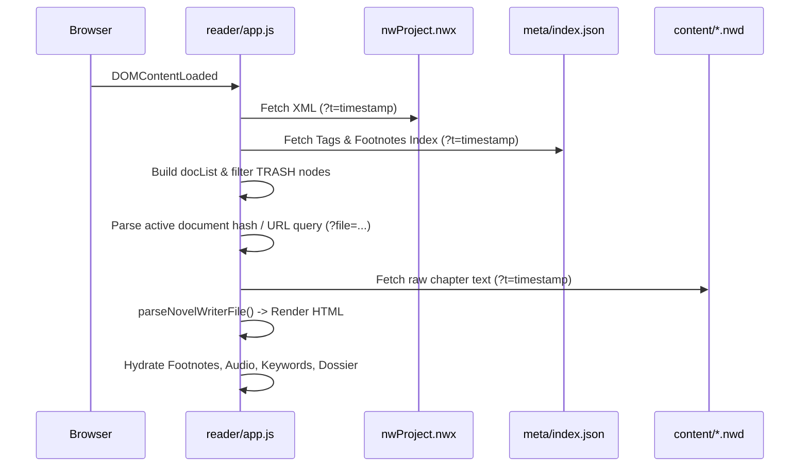

# Reader System Architecture & Engine Specification

The **36th SOT Reader** is a zero-build, client-side web application designed to render novelWriter projects with rich typography, immersive ambient audio, interactive lore dossiers, and retro-futuristic Soviet UI aesthetics.

---

## 🏛️ Core Principles

1. **Zero Build Step**: Runs directly in modern browsers without Babel, Webpack, Vite, or TypeScript compilation.
2. **Vanilla Technologies**: Plain HTML5, ES6+ JavaScript (`reader/app.js`), and Vanilla CSS (`reader/style.css`) using CSS Custom Properties.
3. **No Cache Assumptions**: All network requests fetching `.nwx`, `.json`, `.nwd`, and `.txt` files append a cache-busting timestamp `?t=${Date.now()}`.
4. **Dynamic Data-Driven UI**: Document hierarchy, titles, word counts, metadata, footnotes, and lore cross-references are derived dynamically at runtime from project files.

---

## 📂 File & Directory Layout

```
reader/
├── index.html               # Main Reader DOM structure & UI shells
├── app.js                   # Reader controller, XML parser, markdown parser, UI events
├── style.css                # CSS variables, themes, typography, spotlight & modal styles
├── game.html                # Detective deduction game launcher
├── engine/                  # Deduction & audio sub-engines
│   ├── deduction-engine.js  # Case docket verification & keyword interaction engine
│   ├── deduction-engine.css # Retro CRT / MVD styling for investigation docket
│   ├── bgm-player.js        # Multi-track ambient audio mixer
│   ├── bgm-player.css       # Audio player dock & visualizer styles
│   └── sfx.js               # Sound effects manager (typewriter, chimes, paper rustles)
├── cases/                   # Case dockets (JSON) and progression rules
└── audio/                   # Ambient tracks and Russian pronunciation clips
    └── pronunciations/      # Pre-rendered MP3 clips & index.json
```

---

## 🔄 Data Pipeline & Parsing Workflow



---

## ⚙️ Parsing Rules & Engine Details (`reader/app.js`)

### 1. Document Tree (`nwProject.nwx`)
- Reads the `<project>` XML tree to build `docList`.
- Reconstructs hierarchical parent-child relationships using `handle` and `parent` attributes.
- **Trash Exclusion**: Any element whose ancestor chain leads to a node with `class="TRASH"` is automatically ignored.
- **Dynamic Word Count**: Reads `novelWords` from `<content>` and replaces `[field:textWords]` on the Title Page.
- **Dynamic Title**: Reads `<project><name>` and applies it to `document.title` and the sidebar branding.

### 2. Consolidated Scene Header Suppression
- When multiple sub-scenes are grouped within a chapter container (`isScene: true`):
  - Headings (e.g., `### Scene Heading`) are suppressed from display **unless** they end with an exclamation mark (`### Scene Heading!`).
  - Scene divider separators (`***` or `* * *`) are stripped cleanly.
  - Parent chapter headers are always rendered.

### 3. Dialogue Highlighting & HTML Collision Prevention
- Quotes (`"..."` or `"..."`) are parsed into `<span class="speech-quote">` with syntax color `--speech-default`.
- ⚠️ **Critical Rule**: When generating HTML inside parsed strings (such as footnote references, buttons, or badges), **always use single quotes for HTML attributes**:
  ```javascript
  // CORRECT:
  `<sup><button class='footnote-ref' data-hash='${hash}'>${num}</button></sup>`

  // INCORRECT (Will break dialogue regex!):
  `<sup><button class="footnote-ref" data-hash="${hash}">${num}</button></sup>`
  ```

### 4. Layout Tokens & Formatting
| Source Token | Rendered Output |
| :--- | :--- |
| `>> text <<` | Center-aligned text (on Title page: plain; in novel: flanked by `.scene-divider` lines) |
| `[br]` | `<br>` line break |
| `[vspace]` or `[vspace:N]` | `<div class="vspace" style="height: {N*1.5}em;"></div>` |
| `[b]...[/b]`, `**...**` | `<strong>...</strong>` |
| `[i]...[/i]`, `*...*` | `<em>...</em>` |
| `~~...~~` | `<del>...</del>` strikethrough |
| `==...==` | `<mark>...</mark>` text highlight |
| `[Keyword]` | `<span class="reader-kw" data-word="...">Keyword</span>` |

---

## 🔊 Footnote Pronunciation Audio System

### 1. Cyrillic + IPA Footnote Syntax
In `.nwd` chapter files, Russian terms in footnotes are written as:
```text
%Footnote.fg5hd: _Valenki_ (Валенки [ˈvalʲɪnkʲɪ]): Traditional seamless Russian winter boots...
```

### 2. HTML Token Transformation
The parser converts `([А-Яа-яЁё\-]+)\s*\[([^\]]+)\]` into:
```html
Валенки <button type="button" class="pronounce-btn" data-speak="Валенки" title="Click to hear Russian pronunciation: Валенки">🔊 &#91;ˈvalʲɪnkʲɪ&#93;</button>
```

### 3. Audio Playback Strategy (`speakRussian()`)
1. **Dynamic Transliteration & Index**: Checks `reader/audio/pronunciations/index.json` or falls back to transliteration slug (`audio/pronunciations/${slug}.mp3`).
2. **Offline HTML5 Audio**: Plays the `.mp3` file via `new Audio(src).play()`.
3. **Web Speech Fallback**: If the audio file fails or is missing, falls back to `SpeechSynthesisUtterance(cleanText)` with `lang = 'ru-RU'`.

---

## 🎯 Reader UI Features & Subsystems

### 1. Auto-Bookmark & Scroll Position Resume
- Automatically debounces and saves the current document path and vertical scroll percentage (`scrollTop / scrollHeight`) to `localStorage` under `chronos_bookmark_path` and `chronos_bookmark_ratio`.
- On return, displays a floating `#resume-toast` allowing the user to resume or click **"Restart Chapter"**.

### 2. Zen Focus Mode & Paragraph Spotlight
- **Zen Mode (`Z` / `Esc`)**: Minimizes all distraction UI, sidebar, and headers.
- **Paragraph Spotlight**: Dims non-focused paragraphs to `0.25` opacity while keeping the paragraph near the 35% viewport reading line at `1.0` opacity.
- **Keyboard Paragraph Navigation**: `ArrowUp` and `ArrowDown` smoothly hop between paragraphs.

### 3. Metadata Dossier & Dynamic Character Aliases
- Ingests reference tags (`@pov:`, `@focus:`, `@char:`, `@mention:`, `@tag:`) and splits by comma.
- Dynamically resolves aliases using `tagsIndex` and splits character full names (e.g. *Heinrich Scherer* -> *Heinrich*, *Scherer*).
- Clicking any character badge opens the corresponding Lore Codex entry.

### 4. Global Command & Search Palette (`Ctrl + K` / `Cmd + K`)
- Provides fast fuzzy searching across all chapters, scene titles, and lore codex documents.
- Fully navigable via keyboard (`ArrowUp`, `ArrowDown`, `Enter`, `Escape`).
