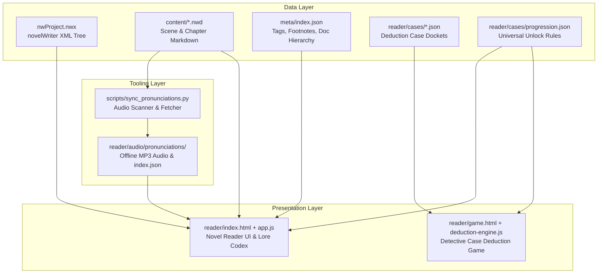

# Project Documentation & Technical Guides

Welcome to the technical documentation repository for **My Best Friend is (about to be) A Killer**.

This directory contains the single source of truth for the project architecture, frontend novel reader, interactive detective deduction game, novelWriter data conventions, and developer guidelines for building, testing, and deploying.

---

## 📚 Table of Contents

| Document | Description |
| :--- | :--- |
| **[1. System Architecture & Reader Engine](./READER_SYSTEM_ARCHITECTURE.md)** | Deep technical guide to `reader/index.html`, `reader/app.js`, and `reader/style.css`. XML parsing of `nwProject.nwx`, cache-busting, text rendering, footnote system, dynamic Russian audio engine, search palette, and focus modes. |
| **[2. Game & Deduction Engine Guide](./GAME_DEDUCTION_ENGINE.md)** | Technical specification of the detective investigation interface (`game.html`, `reader/engine/deduction-engine.js`), JSON case schemas, declarative artifacts, keyword trays, slot validation, BGM/SFX audio engines, and universal progression locks. |
| **[3. Content Authoring & Style Guide](./CONTENT_AUTHORING_AND_STYLE_GUIDE.md)** | Guidelines for writing novel chapters in `.nwd` format. Rules for dialogue, scene dividers, `%Footnote` definitions, Russian term pronunciations `(Слово [IPA])`, collectible keywords `[Word]`, and Siberian retro-futuristic lore conventions. |
| **[4. Dev, Build & Deploy Checklist](./DEV_BUILD_DEPLOY_CHECKLIST.md)** | Practical cheat sheet for AI agents and developers: dev server setup, audio synchronization (`scripts/sync_pronunciations.py`), regression verification checklist, common pitfalls, and GitHub Pages deployment. |

---

## 🏗️ High-Level Project Architecture



---

## ⚡ Quick Reference Commands

```bash
# 1. Start local development server
./run_reader.sh
# Server runs on: http://localhost:8002/reader/

# 2. Synchronize all Russian footnote pronunciations across all chapters
python3 scripts/sync_pronunciations.py

# 3. Verify JavaScript syntax before commits
node -c reader/app.js
node -c reader/engine/deduction-engine.js
node -c reader/engine/bgm-player.js
node -c reader/engine/sfx.js
```
