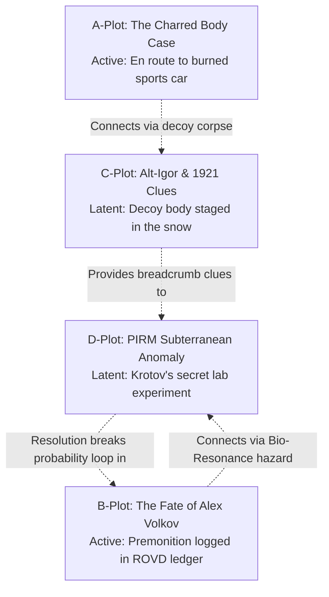

# Character Roster & Plot Tracker

A dynamic reference tracking character statuses, relationship dynamics, active narrative threads, and forensic evidence.

---

## 👥 Character Roster & Current Status

| Character | Affiliation & Role | Current Status / Location | Key Dynamics & Active Hooks |
| :--- | :--- | :--- | :--- |
| **Luka Huo** | Associate Physicist at PIRM | Leaving ROVD with Nadya for the mountain crime scene | Called in sick at PIRM; desperate to save Alex from his murder vision; about to inadvertently become prime suspect. |
| **Junior Lt. Nadezhda "Nadya" Morozova** | Duty Officer at Pogranichny ROVD | Heading to the crime scene with Luka | Bored of desk intake; successfully bribed Uncle Senya to cover her counter; energetic, sharp, lesbian, and intrigued by Luka's vision. |
| **Starshina Semyon "Uncle Senya" Korobov** | Veteran Senior Sergeant at ROVD | Sitting at the intake counter sipping hot oolong tea | 25+ years in service; covered Nadya's shift in exchange for tea and snacks; grandfatherly anchor of the precinct. |
| **Aleksey "Alex" Volkov** | Hardware Engineer at PIRM | Off-screen at PIRM / Dormitory | Luka's charismatic, brilliant, popular best friend; unaware of Luka's haunting premonitions of him. |
| **Igor Valentinovich Romashin** | Regional Logistics Director (Khabarovsk) | Reported dead / charred in sports car | Embezzlement fugitive; his burned vehicle and decoy body was found at 04:30 near the mountain border. |
| **Major Viktor Danilovich Tarasov** | Senior Investigator at ROVD | On-site at the mountain crime scene | Seasoned investigator; golden age detective literature fanatic; strictly procedural; about to clash with Luka's unprovable vision. |

---

## 🧶 Narrative Plot Thread Matrix

### 1. A-Plot: The Charred Body at the Mountain Pass
* **Current State**: Luka and Nadya are en route to the mountain road to inspect the burned sports car reported at 04:30.
* **Key Conflict**: When Luka views the corpse, his 4D vision reveals a gravestone with an entirely different name (*Anatoly Ruzhin*). Major Tarasov will treat his exact foreknowledge as prime-suspect behavior, issuing a strict *Podpiska o nevyezde* travel ban.

### 2. B-Plot: The Premonition of Aleksey Volkov
* **Current State**: Luka filed a formal inquiry at the ROVD. He is plagued by visions of Alex weeping with bloodied hands over a corpse in the snow.
* **Overarching Mystery**: The fated victim is Luka himself, caused by a future sacrificial choice during an unshielded anomaly crisis in PIRM Sub-Level 3. Luka must use Nadya's philosophy of agency to alter the timeline.

### 3. C-Plot: The 1921 Red Army Soldier (Alt-Igor)
* **Current State**: Staged his death using a natural heart-attack victim (*Anatoly Ruzhin*) to escape modern anti-corruption audits.
* **Upcoming**: Alt-Igor hides in Pogranichny leaving mysterious 1920s breadcrumb clues (triangular *treugolnik* notes, archaic bullet casings) to guide Luka toward the real conspiracy.

### 4. D-Plot: The Sub-Level 3 PIRM Bio-Resonance Crisis
* **Current State**: Dr. Krotov secretly extracted an unshielded Time Ripple anomaly fragment into an underground laboratory.
* **The Hazard**: Chrono-Sensitives like Luka act as bio-resonance conduits if exposed, risking an apocalyptic temporal collapse.

---

## 🗃️ Active Evidence & Inventory Log

1. **Luka's PIRM Institute Badge**: Laminated credentials identifying him as an Associate Physicist at PIRM; establishes his scientific credibility.
2. **Nadya's Brass Desk Nameplate**: Engraved with *Мл. Лейтенант Морозова* (Jr. Lt. Morozova); led Nadya to believe Luka guessed her name from the counter.
3. **Electro-Cellulose Incident Form**: Digital intake form synced from the *Setun* terminal containing Alex Volkov's portrait.
4. **Physical Ballpoint Pen Dual-Copy Manifest**: Signed paper document filed in the ROVD drawer per post-Ripple non-electronic compliance rules.
5. **MVD Wanted Notice (Igor Romashin)**: Digital e-paper bulletin detailing Romashin's charges of embezzlement and flight from Khabarovsk.
