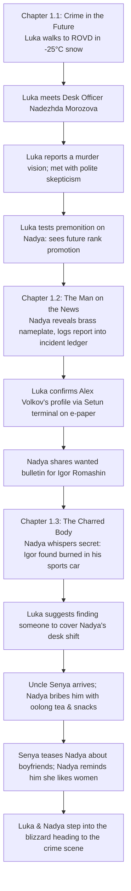

# Story Progression Summary (Chapters 1.1 – 1.3)

A detailed summary of all events, character interactions, and narrative developments in **My Best Friend is (about to be) A Killer** up to the current point.

---

## 📅 Chronological Timeline of Events

---

## 📖 Chapter-by-Chapter Narrative Breakdown

### Chapter 1.1: Crime in the Future (`content/27601e10419ce.nwd`)
* **Setting the Scene**: On a biting Siberian morning (-25°C), **Luka Huo**—a half-Chinese, half-Russian theoretical physicist fellow at the **Pogranichny Institute of Relativistic Mechanics and Geo-Cosmic Dynamics (PIRM)**—walks on foot to the **Pogranichny ROVD** precinct.
* **The Atmosphere**: The station is surprisingly quiet three months after the cosmic **Time Ripple** catastrophe. Inside, the foyer is warm from municipal *Teploset* radiators, smelling of floor wax, pipe tobacco, and coffee.
* **The Absurd Report**: Luka sits down at the intake counter with **Junior Lieutenant Nadezhda "Nadya" Morozova**. Struggling with the humiliation of reporting an uncommitted crime, Luka admits he has been experiencing visions of an impending murder.
* **The Dilemma of the Vision**: When Nadya assumes an active crime is taking place, Luka clarifies that it exists solely as a premonition. Because anti-hallucinogens and neuro-stabilizers failed to stop it, he genuinely fears for his best friend.
* **The Empirical Test**: Seeing his PIRM institute badge and genuine desperation, Nadya innocently asks if he can see *her* future. Luka seizes the opportunity to test his hypothesis empirically, focusing his perception on her as his vision melts into a 4D worldline projection.

---

### Chapter 1.2: The Man on the News (`content/8e0179d6fe5e5.nwd`)
* **The Outcome of the Test**: After spacing out for three minutes, Luka reveals what he foresaw: she will be promoted to **Senior Lieutenant** before the year ends, addressing her by her surname *Comrade Morozova*.
* **The Deflating Realization**: Nadya is initially stunned, but quickly bursts into a giggle—she points to the brass nameplate sitting on her desk, assuming he simply read it. Believing promotion to Senior Lieutenant is too wildly optimistic, she treats it as flattering encouragement.
* **Official Intake**: Touched by his sincerity and exhaustion, Nadya drops official stiffness to help him off the record by logging an official inquiry form into the district ledger.
* **Confirming Aleksey Volkov**: Using the precinct's balanced-ternary *Setun* terminal, Nadya brings up **Aleksey "Alex" Volkov's** profile onto an electro-cellulose e-paper tablet. Luka confirms Alex—his brilliant, charismatic, popular hardware engineer best friend at PIRM.
* **Analog Dual-Copy Mandate**: Following post-Ripple emergency regulations, Nadya transcribes the statement with a ballpoint pen on physical paper, which Luka signs.
* **The Wanted Bulletin**: As Luka prepares to leave, Nadya slides another e-paper across the counter: an official MVD wanted poster for **Igor Valentinovich Romashin**, a regional logistics director accused of embezzlement. Luka recognizes his face from recent morning news broadcasts.

---

### Chapter 1.3: The Charred Body (`content/1bd7b006c55ac.nwd`)
* **The Secret Leaked**: Luka confirms he hasn't seen Igor Romashin. Finding Luka trustworthy and dying to vent, Nadya whispers confidential news: **Igor Romashin was found dead this morning, burned to a crisp in his sports car right here in Pogranichny.**
* **The Desk Officer's Frustration**: Nadya vents her extreme frustration at being trapped at the front intake desk during the biggest case in the district while patrol officers get to visit the crime scene.
* **The Scheme**: Luka casually asks if someone could cover her shift. Seizing on the idea, Nadya preps a hand-over manifest just as veteran **Starshina Semyon "Uncle Senya" Korobov** stomps into the precinct in his heavy felt *valenki* boots and *ushanka* fur cap.
* **Bribing Uncle Senya**: Nadya pleads with Uncle Senya to cover her counter for just an hour, bribing him with promises of pastries, snacks, and a cup of hot oolong tea. Fond of supporting eager young officers, Senya cheerfully approves the request.
* **The Banter & Dynamics**: As Senya pours his tea, he teases Nadya about whether Luka is her new boyfriend. Nadya firmly and exasperatedly reminds him that she likes women, which Senya laughs off with grandfatherly good humor.
* **Setting Off**: Having already called in sick at PIRM and drawn by intense scientific and personal curiosity, Luka agrees to accompany Nadya. They bundle into their winter coats and step out into the freezing April blizzard, bound for the charred car crime scene.

---

## 📍 Current Story State & Next Milestone
* **Current Location**: Exiting Pogranichny ROVD precinct into the snow.
* **Destination**: The mountain road / border pass where Igor Romashin's sports car burned.
* **Immediate Anticipated Events**:
  1. Arriving at the crime scene and encountering **Major Viktor Danilovich Tarasov** (the iron-faced, Golden Age detective fanatic Senior Investigator).
  2. Luka observing the burnt corpse and receiving a 4D premonition of a gravestone bearing an entirely different name (*Anatoly Ruzhin*), setting off the ticking clock of suspicion.
